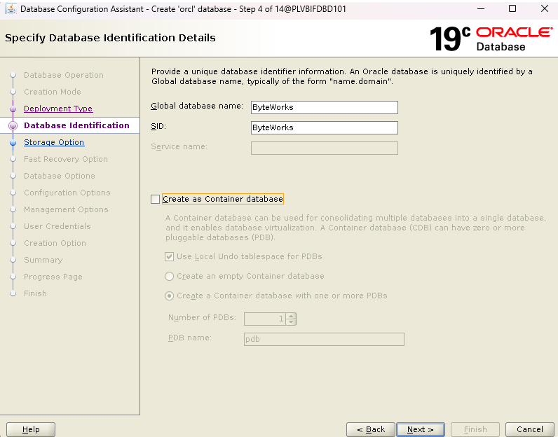
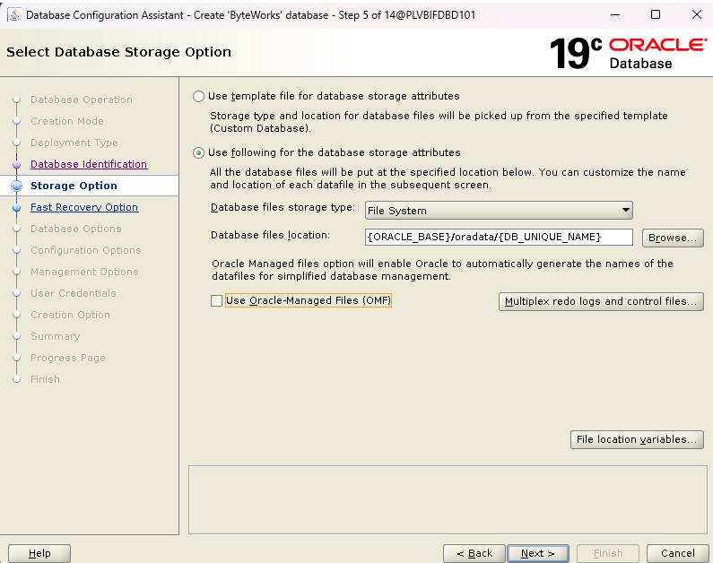
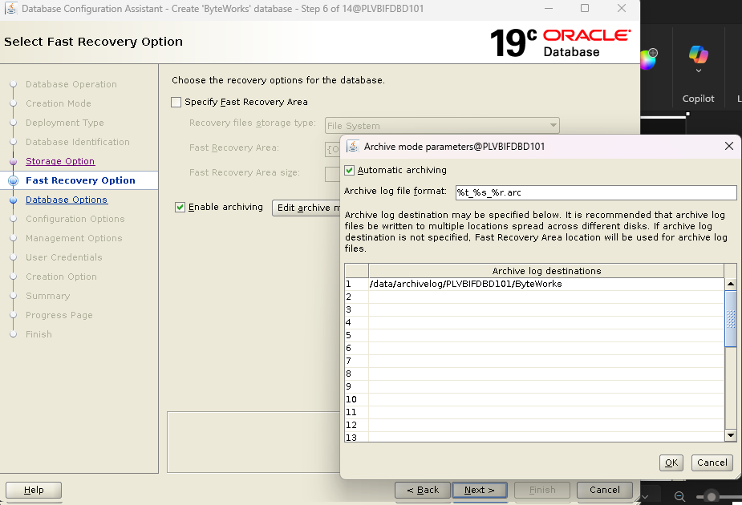
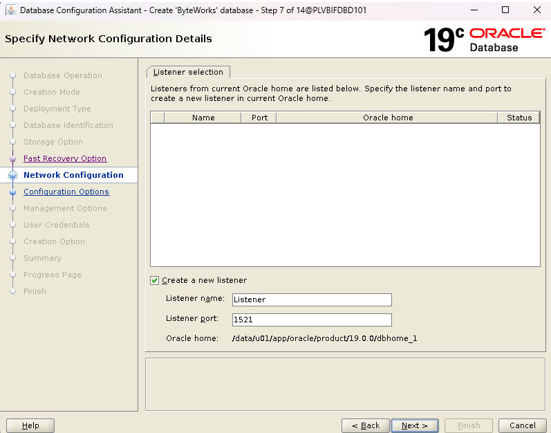
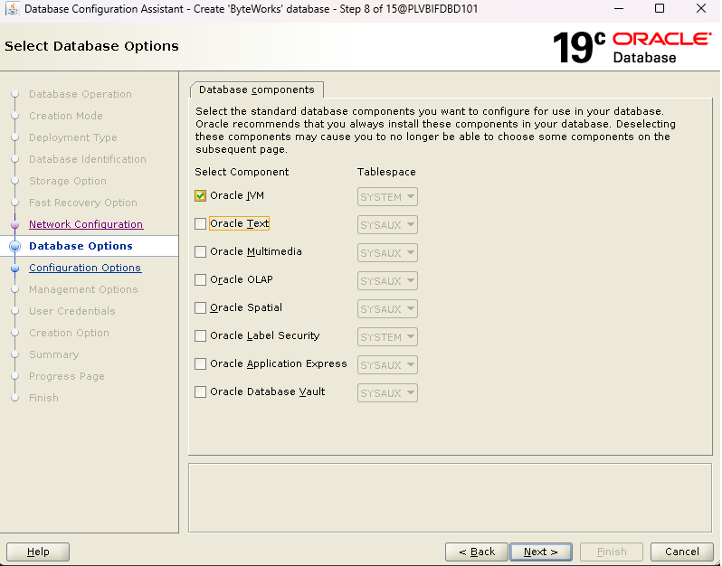
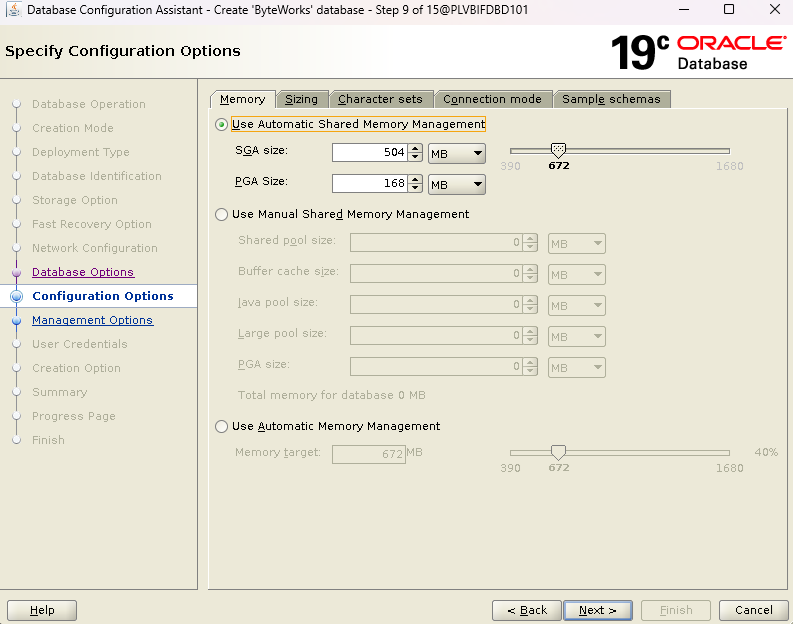
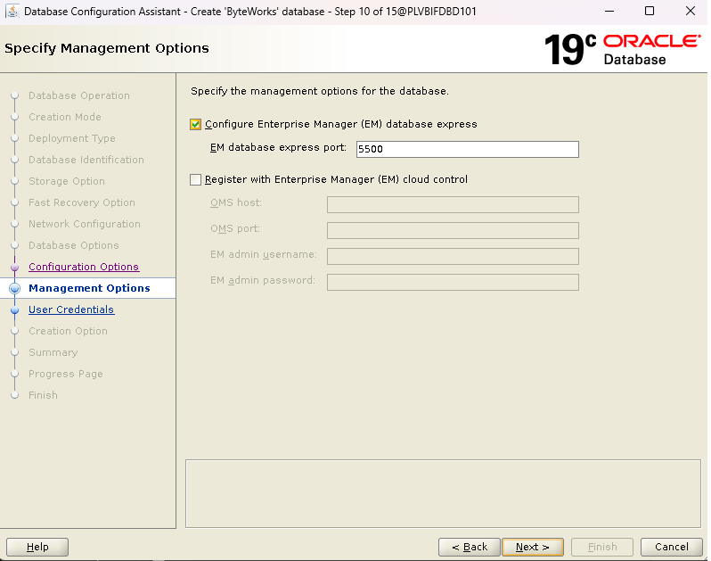
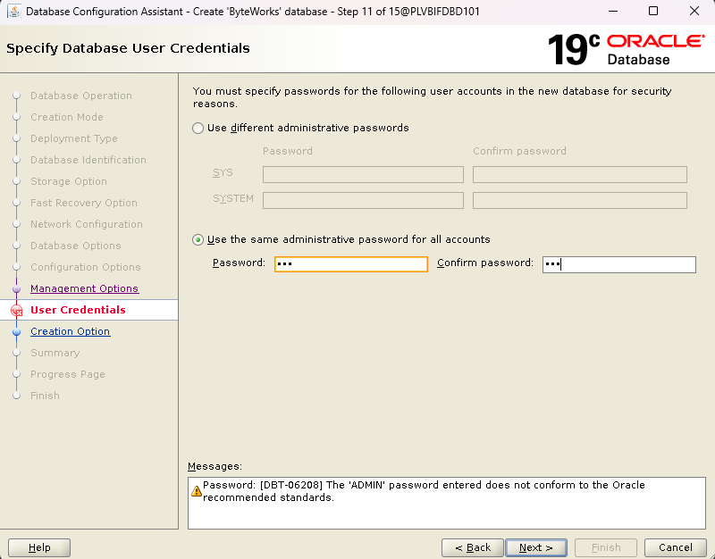
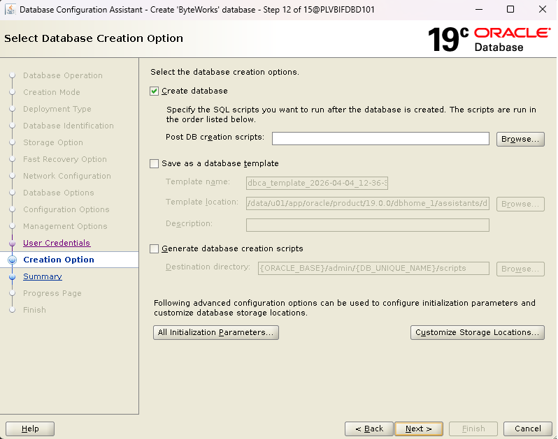

<h1>How To Create Database On Oracle 19C</h1>

Step 1 - Open DBCA dan Pilih Create Database

Step 2 - Pilih Advance Configuration

Step 3 - Pilih Custom Database

Step 4 - Masukan Global Database yang kamu inginkan, serta uncheck container (OPTIONAL) 

Step 5 - Pilih Use following for database storage attributes, database file location defaul / disesuaikan (OPTIONAL) 

Step 6 - Pilih Enable Archiving, dan masukan tempat dimana archive akan disimpan dengan format .arc

Step 7 - Create listener baru, dengan nama yang diinginkan

Step 8 - Checklist hanya pada JVM

Step 9 - Pilih Use automatic shared memory

Step 10 - Checklist OEM

Step 11 - Use The same password 

Step 12 - Checklist Create database

