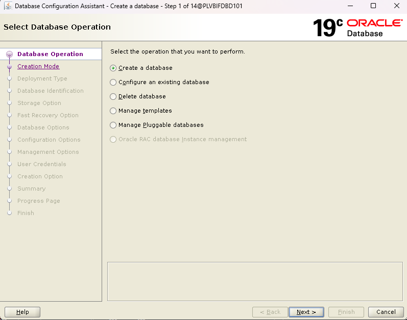
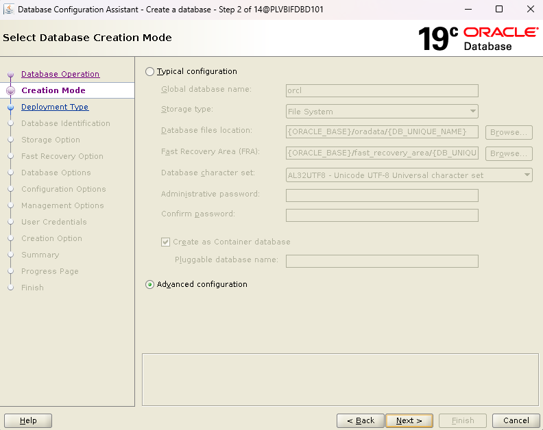
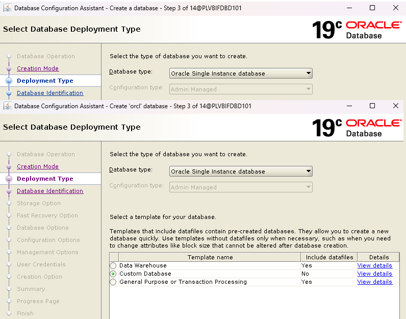

<h1>How To Create Database On Oracle 19C</h1>

<h2>Step 1 - Open DBCA</h2>

Pilih Create Database

<h2>Step 2 - Advance Configuration (OPTIONAL)</h2>

Pilih Advance Configuration

<h2>Step 3 - Open DBCA</h2>

Pilih Create Database

